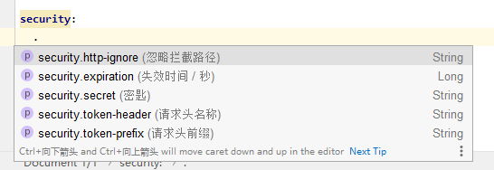

> 一键整合 spring security 

install本项目到本地仓库后： 

```
新建一个 LoginUserDetailsService implements UserDetailsService 
```

```java
@Component
public class LoginUserDetailsService implements UserDetailsService {

    @Resource
    private UserService userService;

    /**
     * 用户登录
     * @param account 账号
     * securityUser.setLocked(true); 锁定用户
     * @return token
     */
    @Override
    public UserDetails loadUserByUsername(String account) {
        User loginUser = userService.getOneByParam(new User().setPhone(account));
        if (loginUser == null) {
            throw new UsernameNotFoundException("账号不存在");
        }
        String ok="1";
        SecurityUser securityUser= new SecurityUser();
        if (!ok.equals(loginUser.getStatus())){
            securityUser.setEnabled(false);
        }else {
            securityUser.setEnabled(true);
        }
        return securityUser.setUsername(loginUser.getUserName()).setPassword(loginUser.getPassword()).setUserId(loginUser.getId());
    }

}
```

> 配置说明： 默认登陆接口 /login

